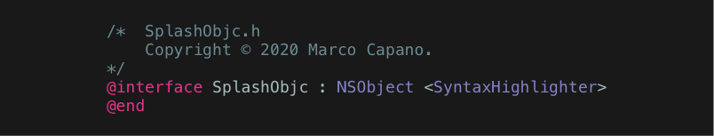
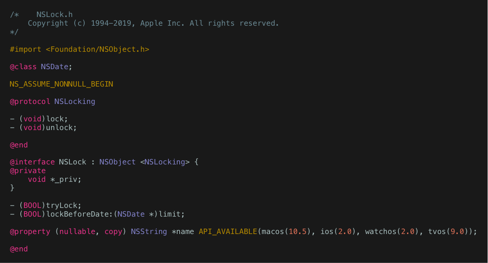

# SplashObjc
<p align="center">
    
</p>

<p align="center">
    <a href="https://swift.org/package-manager">
        
    </a>
     
    <a href="https://twitter.com/marcocapano1">
        
    </a>
</p>

This is **SplashObjc**, an Objective-C syntax highlighter based on [Splash](https://github.com/JohnSundell/Splash), a Swift syntax highlighter. It can be used to generate HTML and Images and `NSAttributedString`s from your Objective-C code.

It is already quite capable, with support for blocks, macros, functions, control statements, classes, procolocols, properties, object literals and more.
See the following example image, generated with SplashObjc from Foundation's `NSLock.h`:



## Usage

SplashObjc can be used as a Swift Package, or you can use one of the command line tools provided!

To install using the Swift Package Manager:

```swift
.package(url: "https://github.com/marcocapano/SplashObjc", from: "0.3.2"))
```

The command line tools mimic the ones provided by Splash's swift version, so that if you know how to use that already, using these should be easy.

#### SplashObjcHTMLGen

`SplashObjcHTMLGen` generates HTML that you can copy and paste wherever you need 

For example, if you call it like this:

```
$ SplashObjcHTMLGen "[UIView alloc] init];"
```

You'll get the following output back:

```html
[<span class="type">UIView</span> <span class="call">alloc</span>] <span class="call">init</span>];
```
Since it uses Splash under the hood, it supports themes, which you can provide in the form of `.css` files. 
To learn more about the html format, see the original source [here](https://github.com/JohnSundell/Splash/blob/master/Sources/Splash/Output/HTMLOutputFormat.swift)

When rendering your outputted html, make sure to wrap your output code in the `<pre>` and `<code>` tags and properly link to your `.css` file. Like this:

```html
<!DOCTYPE html>
<head>
    <title>Hello World</title>
    <link rel="stylesheet" href="style.css">
</head>

<pre>
    <code>
        [<span class="type">UIView</span> <span class="call">alloc</span>] <span class="call">init</span>];
    </code>
</pre>
```

#### SplashObjcImageGen

`SplashObjcImageGen` generates `NSAttributedString` using SplashObjc, draws the string on an image and stores it to disk.
Note that because of the dependency on `NSAttributedString`, the tool is only available on macOS.`

For example, if you call it like this:

```
$ SplashObjcImageGen "[UIView alloc] init];" Code.png
```

The following image will be generated (and written to disk as `Code.png`):


#### SplashTokenizer

If you're interested in seeing the actual bits the package produces, you can use the tool `SplashObjcTokenizer`.
Example:

```
$ SplashObjcTokenizer "[UIView alloc] init];"
```

Output:

```
Plain text: [
Type token: UIView
Call token: alloc
Plain text: ]
Call token: init
Plain text: ];
```

### 📦 Using it in your projects

Since it comes as a package, once installed you can simply import it and start using it like this:

```swift
import SplashObjc

let highlighter = SyntaxHighlighter(format: HTMLOutputFormat(), grammar: ObjcGrammar())
let html = highlighter.highlight("[UIView alloc] init];")
```

You can even create your own custom  `OutputFormat`.

## Installation

### 🛠 Command line tools

If you want to use the command line tools, clone the repo:

```
$ git clone https://github.com/marcocapano/SplashObjc.git
$ cd SplashObjc
```

Then install all the tools in your `/usr/local/bin` like this:

```
$ make install
```

# Acknowledgements

This project could not exist without the work on Splash by [John Sundell](https://github.com/JohnSundell/). 
If you like this project, I strongly recommend you try creating support for another language. John has made a really great job making the code readable and easy to work with.

### Why is this not a fork of Splash?

I could have just forked the Splash project, added `ObjcGrammar.swift` and its tests and modified the command line tools provided to accept a grammar parameter. The reason i didnt is I would then have had to manually merge the original project with future updates.

Instead, by using SwiftPM, the whole process is nicer 😊

# Contacts

[marco24capano@icloud.com](mailto:marco24capano@icloud.com)

[marcocapano.dev](https://marcocapano.dev)

If you'd like to contribute or if you see any missing thing or mistake, please do not esitate to contact me or open a PR!
